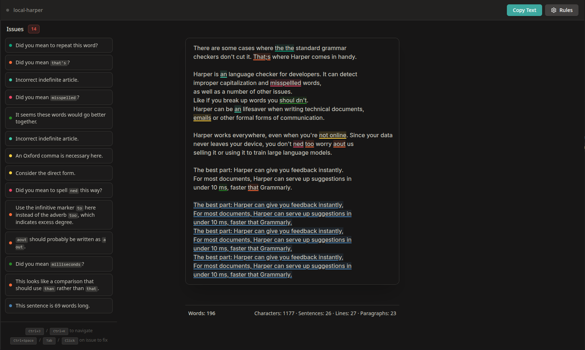

# local-harper


## todo
- [x] clicking on an issue in the sidebar should focus the editor so ctrl+space works
- [ ] gui dictionary manager
- [ ] gui rule manager
- [ ] figure out how to publish on github pages (maybe cdn harper's wasm thing)
- [ ] sidebar toggling
- [ ] PWA support
	- [ ] test fully offline

## installation & try it out
pre-req: [pnpm](https://pnpm.io/installation).
```bash
git clone https://github.com/KraXen72/local-harper
cd local-harper
pnpm i
pnpm dev
```

## testing text:
```
There are some cases where the the standard grammar
checkers don't cut it. That;s where Harper comes in handy.

Harper is an language checker for developers. It can detect
improper capitalization and misspellled words,
as well as a number of other issues.
Like if you break up words you shoul dn't.
Harper can be an lifesaver when writing technical documents, 
emails or other formal forms of communication.

Harper works everywhere, even when you're not online. Since your data
never leaves your device, you don't ned too worry aout us
selling it or using it to train large language models.

The best part: Harper can give you feedback instantly.
For most documents, Harper can serve up suggestions in
under 10 ms, faster that Grammarly.
```