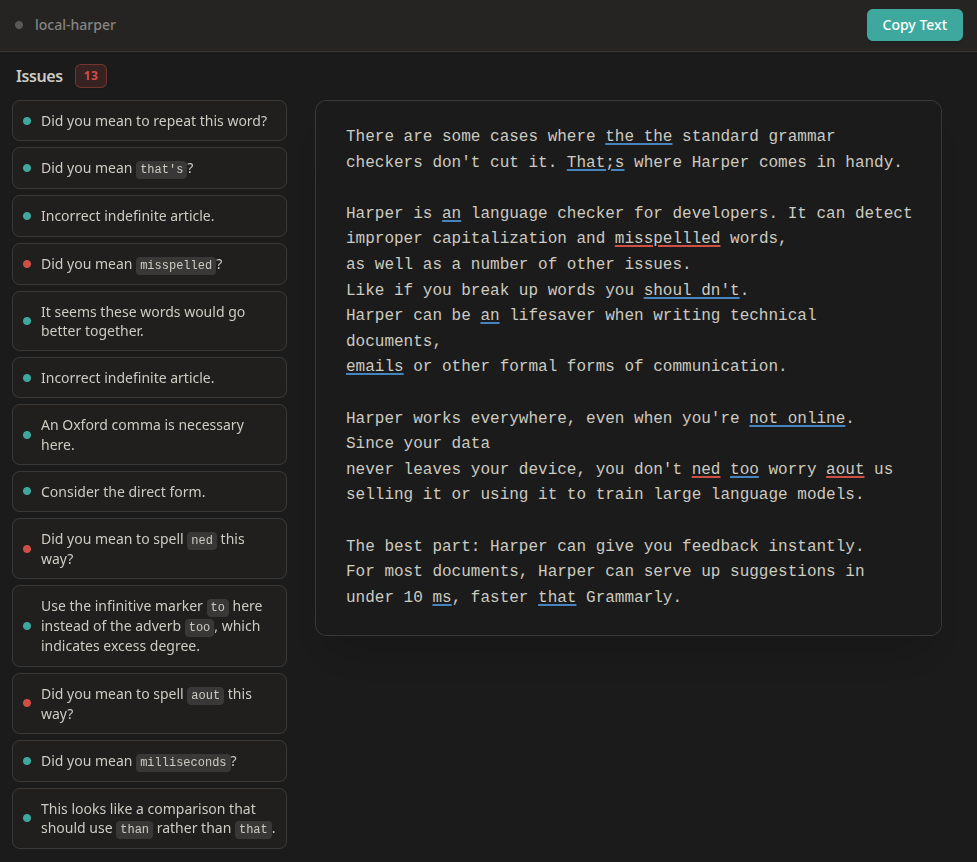

# local-harper


The main idea is that it uses Codemirror as the editor framework, since it's pretty lightweight and has a lot of plugins.  
- The suggestions are handled using `@codemirror/autocomplete` and some custom handling, so you can use both your keyboard and mouse to accept them
- The underlining is using `@codemirror/lint`, so it's properly integrated with the editor and doesen't have any de-syncing issues when scrolling

## features
- live, performant and local grammar checking with [harper](https://github.com/Automattic/harper)
- keyboard shortcuts & navigation
- issue sidebar: clicking issue in editor focused sidebar and vice-versa
- initial dictionary support (localStorage)
- sleek UI built with solid-js and tailwindcss@4
- rule manager
- planned: dictionary manager

## installation & try it out
pre-req: git, nodejs, [pnpm](https://pnpm.io/installation).
```bash
git clone https://github.com/KraXen72/local-harper
cd local-harper
pnpm i
pnpm dev
```

## testing text:
```
There are some cases where the the standard grammar
checkers don't cut it. That;s where Harper comes in handy.

Harper is an language checker for developers. It can detect
improper capitalization and misspellled words,
as well as a number of other issues.
Like if you break up words you shoul dn't.
Harper can be an lifesaver when writing technical documents, 
emails or other formal forms of communication.

Harper works everywhere, even when you're not online. Since your data
never leaves your device, you don't ned too worry aout us
selling it or using it to train large language models.

The best part: Harper can give you feedback instantly.
For most documents, Harper can serve up suggestions in
under 10 ms, faster that Grammarly.

The best part: Harper can give you feedback instantly,
For most documents, Harper can serve up suggestions in
under 10 ms, faster that Grammarly,
The best part: Harper can give you feedback instantly,
For most documents, Harper can serve up suggestions in
under 10 ms, faster that Grammarly,
The best part: Harper can give you feedback instantly,
For most documents, Harper can serve up suggestions in
under 10 ms, faster that Grammarly.
```
